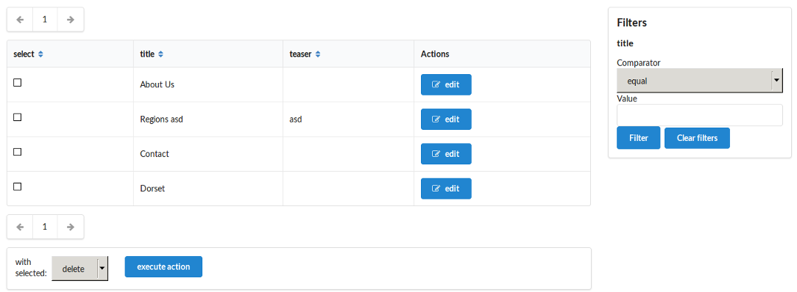
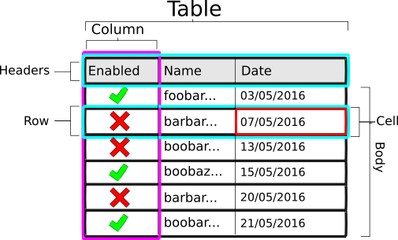
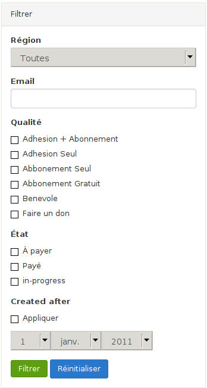

Guide
=====

This guide is intended to help you get started quickly with the Psi Grid
component.

*Example grid from test application (Semantic UI)*

Getting Started
---------------

In order to create a grid we need to create an object agent which the grid
will use to retrieve data, and then we will need to create a grid factory, but
first of all, create an object for which the grid will be based upon:

.. code-block:: php

    <?php

    class Article
    {
        private $title;
        private $body;
        private $createdAt;

        public function __construct($title, $body)
        {
            $this->title = $title;
            $this->body = $body;
            $this->createdAt = new \DateTime();
        }
    }

The object agent is an object manager abstraction layer, in this example we
will use the Doctrine Collections agent so that we can create some in memory
data:

.. code-block:: php

    <?php

    use Psi\Component\ObjectAgent\AgentFinder;
    use Psi\Bridge\ObjectAgent\Doctrine;
    use Psi\Bridge\ObjectAgent\Doctrine\Collections\Store;

    $agentFinder = new AgentFinder([
         new CollectionsAgent(new Store([
                Article::class => [
                    new Article('Article 1', 'It little profits'),
                    new Article('Article 2', 'that an idle king'),
                ]
         ]))
    ]);

.. note::

    If you want to use, for example, the Doctrine ORM persistence layer here, just replace the
    ``CollectionsAgent`` with the ``OrmAgent``.

We can now create the grid factory, in this example we will use the annotation
metadata driver.

.. code-block:: php

    <?php

    use Psi\Component\Grid\GridFactoryBuilder;

    $gridFactory = GridFactoryBuilder::createWithDefaults($agentFinder)
        ->addAnnotationDriver()
        ->createGridFactory();

.. note::

    The grid factory is a service. If you are using dependency injection the
    above code should be used to create f.e. a ``psi_grid.grid_factory``
    service.

Now annotate your ``Article`` as follows:

.. code-block:: php

    <?php

    use Psi\Component\Grid\Metadata\Annotations as Grid;

    /**
     * @Grid\Grid(
     *     columns={
     *         @Column(name="title", type="text"),
     *         @Column(name="body", type="text"),
     *         @Column(name="createdAt", type="date", options={"format": "Y-m-d"),
     *     }
     * )
     */
    class Article
    {
        // ...
    }

You can now create the grid instance for your ``Article`` class:

.. code-block:: php

    <?php

    /** @var Psi\Component\Grid\Grid */
    $grid = $gridFactory->createGrid(Article::class, [ /* options */ ]]);

Your new ``Grid`` object can do two things:

1. Create the grid view.
2. Perform bulk actions.

Actions will be discussed in a :doc:`later chapter<reference/action>`, for now lets just create the
view:

.. code-block:: php

    <?php

    /** @var Psi\Component\Grid\View\Grid */
    $view = $grid->createView();

The grid view should be passed to your templating system. It contains
everything you need to render your grid including the filters, pagination,
headers and the table itself, for example to render a very simple table:

.. code-block:: php

    <?php

    echo '<table>';
    foreach ($gridView->getTable()->getBody() as $row) {
        echo '<tr>';
        foreach ($row as $cell) {
             echo '<td>' . $cell->getValue() . '</td>';
        }
        echo '</tr>';
    }
    echo '</table>';

For more examples see the :doc:`templates` chapter.

Concepts
--------

Columns
~~~~~~~

Columns define how your data will be derived from the result set and how it
will be displayed.

Each defined column has a type which corresponds to a class which builds the
cells and provides the column headers.

All columns have a ``cell_template`` and ``header_template`` option which can be used to override the cell and header templates respectively.

See the :doc:`reference/column` chapter for a full reference.

Filters
~~~~~~~

Filters can be used to filter the grid data.

See the :doc:`reference/filter` chapter for a full reference.

*Example filter from a real project*

Actions
~~~~~~~

Actions are routines which can be executed on selected record. It is required
that a column of type ``SelectColumn::class`` (``select``) is defined in the grid.

A typical action might be "Delete selected records".

See the :doc:`reference/action` chapter for a full reference.

Queries
~~~~~~~

By default, the grid will act upon a collection of objects provided by your
object agent (e.g. Doctrine ORM etc). But you can also specify a custom query
based on the object agent query DSL.

The result of this will differ depending on the agent you use, and may not be
possible at all with some agents. So this can be where the abstraction begins
to break down.

Nethertheless, it is often better to specialize when creating complex grids.

In the following example an query is defined. The query will always select
from the mapped class, but you may add joins and select fields. The grid
definition must then specify the query as its data source.

.. code-block:: php

    <?php

    /**
     * @Grid\Query(
     *     name="details",
     *     selects={ 
     *         "a.id": "id", 
     *         "a.active": "actif", 
     *         "a.firstName": "prenom", 
     *         "a.lastName": "nom", 
     *         "a.email": "email", 
     *         "a": "user", 
     *         "p.title": "qualite"
     *     },
     *     joins={ 
     *         { "join": "a.product", "alias": "p" },
     *         { "join": "a.orders", "alias": "o", "type": "LEFT" },
     *     },
     * )
     * @Grid\Grid(
     *     name="default",
     *     query="details",
     *     columns={
     *         @Grid\Column(name="select", type="select", options={"property": "[id]"}),
     *         @Grid\Column(name="actif", type="boolean"),
     *         @Grid\Column(name="email", type="property"),
     *         @Grid\Column(name="qualite", type="property"}),
     *         @Grid\Column(name="region", type="property", options={"property": "[user].getRegionName"}),
     *     }
     * )
     */
    class User
    {
        // ...
    }

Now, the data from the query is an array, therefore, when specifying a
property, it is necessary to employ the square bracket syntax.

.. note:: 

    The default behavior is to use the column name as the property, in which
    case the column will automatically determine how the property should be
    accessed.
